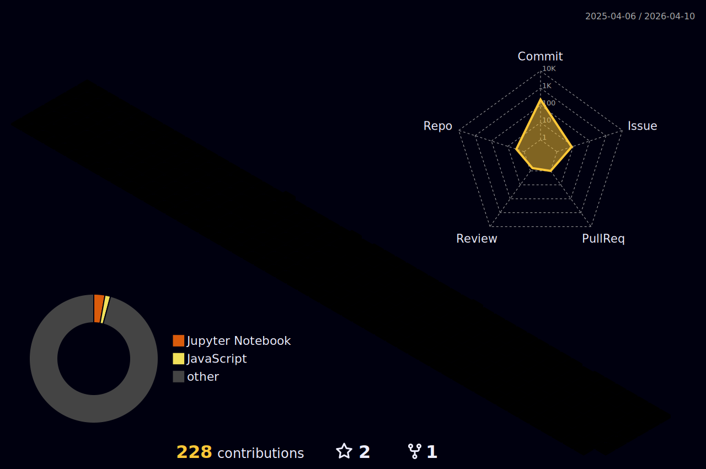

    
  
        
         
       
  
  
  

--------------------------------------------

  
###    About Me      

🌟 Integrated M.S.-Ph.D. student in Computer Engineering at CBNU, Republic of Korea, conducting research on NLP, LLMs, and task-specific prompt engineering.

🚀 Ph.D. student in computer engineering, always tired and powered by coffee.

👩🏻‍💻 Dreaming of becoming an AI Engineer and professor.

 

### 📚 SKills 📚

##### ::Related to AI::

     

 

##### ::IDE and terminal::

   

 

##### ::Related to Web::

          

  

 

##### ::Related to design::

    

 

##### ::Follow and reach me::

     

 

### 🧐 And, I'm still learning... 🧐 

 
 

