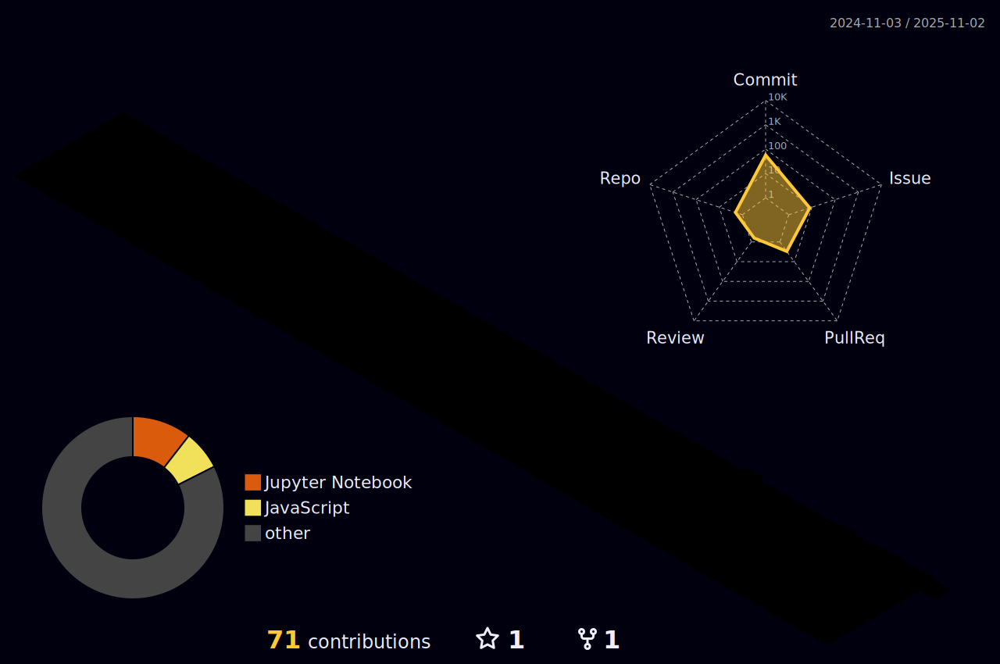

    
  
        
         
       
  
  
  

--------------------------------------------

  
###    About Me      

🌟 Integrated M.S.-Ph.D. student in Computer Engineering at CBNU, Republic of Korea, conducting research on NLP, LLMs, and task-specific prompt engineering.

🚀 Ph.D. student in computer engineering, always tired and powered by coffee.

👩🏻‍💻 Aspiring AI Researcher and Professor

 

### 📚 SKills 📚

##### ::AI Stack::

   
 
 
    
 
 
   

 

##### ::Tools::

  

  

<!--

 

##### ::Related to Web::

        

  

##### ::Related to design::

  

 

!-->

 

##### ::How to reach me::

  

  

--------------------------------------------

### 🧐 And, I'm still learning... 🧐

 

 

